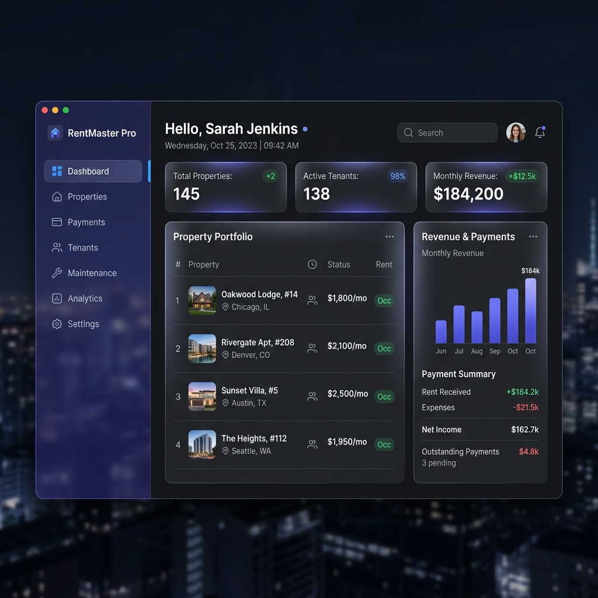
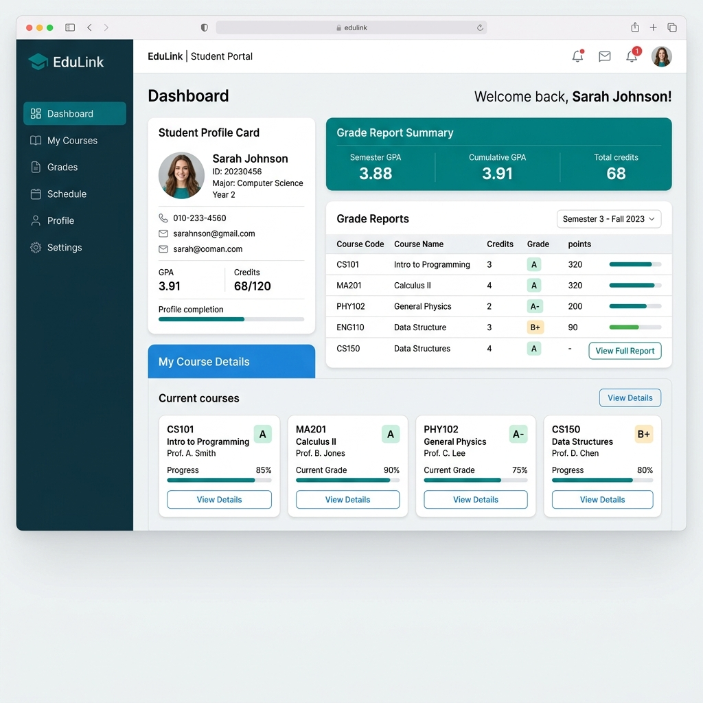

# ⚡ Professional Portfolio

---

## 📋 Executive Summary

This project is a modern, high-end, fully responsive developer portfolio website built strictly in accordance with front-end submission guidelines. It showcases core engineering proficiencies using **only native web technologies**—HTML5, CSS3, and Vanilla JavaScript—without using React, Vue, Angular, Bootstrap, Tailwind CSS, or any other external library.

The application features advanced glassmorphism styling, scroll-driven micro-animations, real-time client-side form validation, and **complete local state persistence** via browser storage. It showcases a premium user interface designed to match modern software industry standards.

---

## �️ Technical Skills

- **Frontend:** HTML5, CSS3, JavaScript, Responsive Web Design
- **Backend:** PHP, RESTful web concepts
- **Database:** MySQL, data modeling, CRUD operations
- **Programming:** Java, object-oriented programming basics
- **Tools:** Git, GitHub, VS Code, Live Server
- **Concepts:** UI/UX design, accessibility, form validation, local storage

---

## �🚀 Key Functional Features

### 1. 🌓 Dual Theme Controller (Light / Dark Mode)
- Default Obsidian Dark mode with Cyan/Indigo gradients.
- High-contrast Soft Slate Light mode.
- System color preference detection with auto-matching.
- State persistence using browser `localStorage` to prevent flashes of unstyled theme layouts on page reloads.

### 2. 📸 Custom Profile Photo Editor (WebRTC & File Explorer)
- **Browse Files:** Uploads standard local images (JPG, PNG, WebP, etc.) using `FileReader` API.
- **WebRTC Camera Capture:** Opens an inline video stream container using the device camera (`getUserMedia`), showing a mirrored preview for capturing profile pictures on the fly.
- **Native Mobile Fallback:** Automatically falls back to native device camera prompts (`capture="user"`) if browser camera permissions are blocked.
- **Persistence:** Encodes photo selections to base64 Data URLs and saves them directly to `localStorage` for complete browser persistence. Includes a **Remove (X)** action button to restore the default SVG developer avatar.

### 3. 📄 Functional CV / Resume Customizer
- Let's users upload a custom PDF CV via the upload trigger next to the download button.
- Converts the custom PDF into base64 and saves it to `localStorage`.
- Dynamically updates all download links (in the hero action and sitemap footer) to compile and download the newly uploaded PDF instead of the placeholder `assets/resume.pdf`.
- Shows a green **"Custom CV"** indicator badge when active and supports a **Reset** button to restore defaults.

### 4. 🎛️ Interactive Project & Skill Filtering
- Chip filters allow users to sort skills (All, Front-End, Back-End, Database, Tools) and academic projects (All, Desktop Java, Web PHP) with smooth opacity scaling transitions.

### 5. 📧 Accessible Form Validation & Toast Alerts
- Custom client-side validation check (Name length, email formatting regex, subject length, and message details).
- Real-time inline error labeling for accessibility.
- Styled floating success and error toast notification popups.

---

## 📁 Repository Directory Structure

The repository maintains a clean, modular structure:

```
portfolio/
├── index.html            # Primary landing page (SEO tags, semantic grid, SVG icons)
├── LICENSE               # MIT License file
├── README.md             # Developer submission documentation
├── css/
│   ├── style.css          # Design system, variables, layouts, and custom modules
│   ├── responsive.css     # Responsive viewport layout breakpoints (Desktop -> Mobile)
│   └── animations.css     # Cursor blinks, floating blobs, scroll triggers keyframes
├── js/
│   ├── main.js            # General listeners, validation, filters, and WebRTC uploads
│   ├── theme.js           # Theme switching controller and localStorage handler
│   ├── typing.js          # Cursor TypeWriter class cycles for hero headers
│   └── animation.js       # Viewport observer, statistics counters, progress bars
└── assets/
    ├── resume.pdf         # Default placeholder PDF CV
    ├── images/            # High-resolution generated mockup banners
    │   ├── house_rental.png
    │   └── student_management.png
    ├── icons/             # Optional vector assets directory (empty; SVGs are inline)
    └── fonts/             # Local typography fonts (falls back to Google Fonts CDN)
```

---

## 💻 Academic Projects Catalog

The portfolio showcases two principal academic projects developed during the developer's first three years of IT study:

### 1. House Rental Management System (Desktop - Java & MySQL)
* **Description:** A desktop application designed for property managers to handle property listings, tenant details, payment records, and maintain transactional CRUD states.
* **Key Features:** Desktop Swing GUI, property occupancy registers, payment histories, search query processing.
* **Repository Link:** [FshaMekonen/House-rental-managment-system](https://github.com/FshaMekonen/House-rental-managment-system)
* **Preview Mockup:**
  

### 2. Student Management System (Web - HTML, CSS, PHP & MySQL)
* **Description:** A web application for registrar administrators to handle student enrollment, grade logs, course mappings, and administrative authentication.
* **Key Features:** Secure session logins, grade calculations, relational database normalization.
* **Repository Link:** [FshaMekonen/Student-managment-system](https://github.com/FshaMekonen/Student-managment-system)
* **Preview Mockup:**
  

---

## 🎨 Design System Specifications

* **Fonts:** `Outfit` (headings) and `Inter` (body) imported from Google Fonts.
* **Dark Mode Palette:**
  * Background: Obsidian Blue (`#090d16` to `#0f1524`)
  * Container: Translucent Glass (`rgba(17, 24, 39, 0.65)`) with `backdrop-filter: blur(16px)`
  * Accent: Electric Indigo (`#6366f1`), Violet (`#8b5cf6`), and Cyan (`#06b6d4`)
* **Light Mode Palette:**
  * Background: Creamy Soft Slate (`#f8fafc` to `#f1f5f9`)
  * Container: Translucent White Glass (`rgba(255, 255, 255, 0.75)`)
  * Accent: Indigo (`#4f46e5`) and Violet (`#7c3aed`)
* **Accessibility Standards:** High-contrast text configurations, visible keyboard focus indicators, explicit ARIA labels on controls, semantic landmarks (`<header>`, `<nav>`, `<main>`, `<section>`, `<footer>`), and accessible form controls.

---

## ⚙️ How to Run the Project

Since the project uses purely native client-side files, it can be viewed by opening `index.html` directly in a browser. However, to run it using a local server environment (which prevents CORS warnings and enables smooth WebRTC device queries), follow these options inside VS Code:

### Option A: Using the VS Code "Live Server" Extension
1. Open the directory `portfolio/` in VS Code.
2. Install the **Live Server** extension (by Ritwick Dey).
3. Right-click index.html and select **Open with Live Server**.
4. The site will launch on `http://127.0.0.1:5500`.

### Option B: Using the Integrated VS Code Terminal
Open the VS Code terminal (`Ctrl + ~`) and start a server:

* **With Python:**
  ```bash
  python -m http.server 8000
  ```
  Navigate to `http://localhost:8000`.

* **With Node / npm:**
  ```bash
  npx http-server ./ -p 8000
  ```
  Navigate to `http://localhost:8000`.

---

## 👤 Submitted By

### **Fsha Mekonen**

| Field | Details |
|---|---|
| **Position Applied For** | Full Stack Developer Intern |
| **Academic Background** | B.Sc. in Information Technology, Axum University (Expected Graduation: 2027) |
| **Location** | Axum, Tigray, Ethiopia |
| **Email** | [fishmekonenn@gmail.com](mailto:fishmekonenn@gmail.com) |
| **Phone** | [+251 943 667 723](tel:+251943667723) |
| **GitHub** | [github.com/Fshamekonen](https://github.com/Fshamekonen) |
