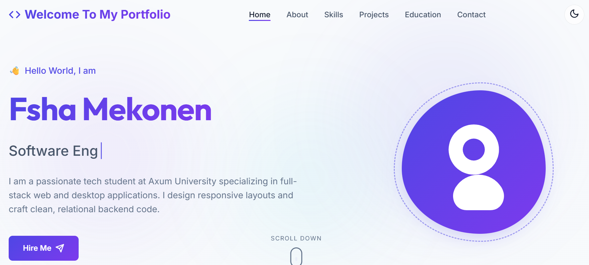
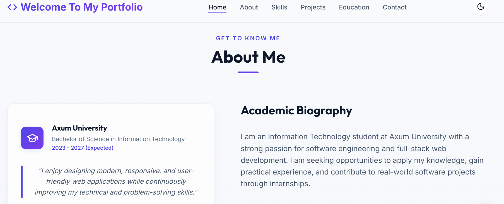
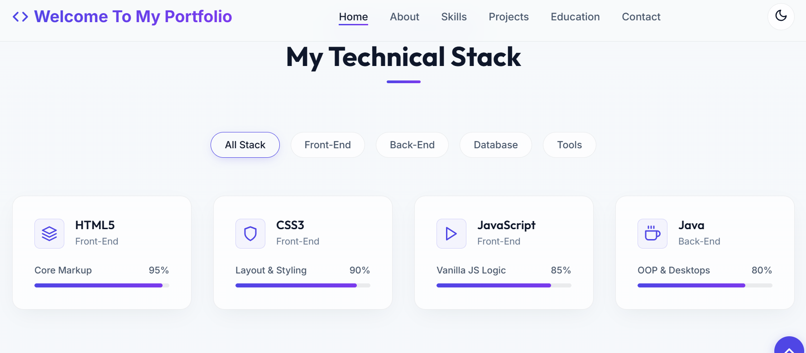
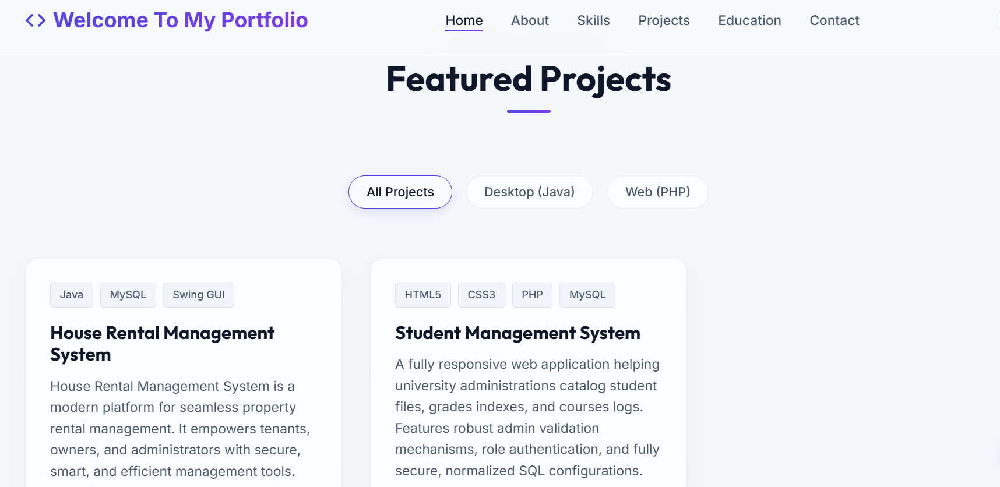
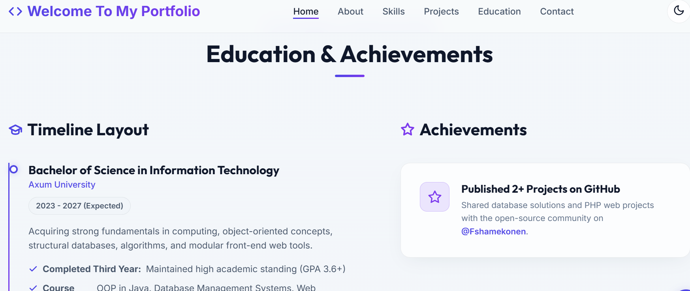
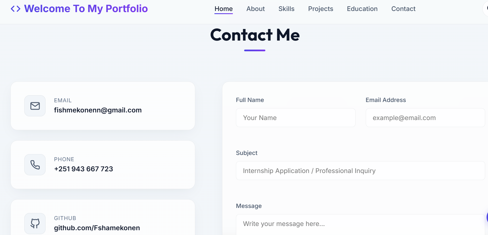

---

## 📋 Executive Summary

This project is a modern, high-end, fully responsive developer portfolio website built strictly in accordance with front-end submission guidelines. It showcases core engineering proficiencies using **only native web technologies** — HTML5, CSS3, and Vanilla JavaScript — without any external frameworks or libraries.

The application features advanced glassmorphism styling, scroll-driven micro-animations, real-time client-side form validation, and complete local state persistence via browser storage. It showcases a premium user interface designed to match modern software industry standards.

---

## 🖼️ Visual Preview

Here are screenshots showing the layout and responsiveness of each portfolio section:

- **Home / Hero**: 
- **About Me**: 
- **Skills**: 
- **Projects**: 
- **Education**: 
- **Contact**: 

---

## 📁 Repository Directory Structure

The repository maintains a clean, modular structure:

```
portfolio/
├── index.html            # Primary landing page (SEO tags, semantic grid, SVG icons)
├── LICENSE               # MIT License file
├── README.md             # Developer submission documentation
├── css/
│   ├── style.css          # Design system, variables, layouts, and custom modules
│   ├── responsive.css     # Responsive viewport layout breakpoints (Desktop -> Mobile)
│   └── animations.css     # Cursor blinks, floating blobs, scroll triggers keyframes
├── js/
│   ├── main.js            # General listeners, validation, filters, and animations
│   ├── theme.js           # Theme switching controller and localStorage handler
│   ├── typing.js          # Cursor TypeWriter class cycles for hero headers
│   └── animation.js       # Viewport observer, statistics counters, progress bars
└── assets/
    ├── profile.png        # Developer profile photograph
    ├── home.png           # Home / Hero section preview
    ├── about.png          # About Me section preview
    ├── skill.png          # Skills section preview
    ├── project.png        # Projects section preview
    ├── education.png      # Education section preview
    ├── contact.png        # Contact section preview
    ├── icons/             # Optional vector assets directory (empty; SVGs are inline)
    └── fonts/             # Local typography fonts (falls back to Google Fonts CDN)
```

---

## 💻 Academic Projects Catalog

The portfolio showcases two principal academic projects developed during the developer's first three years of IT study:

### 1. House Rental Management System (Desktop - Java & MySQL)
* **Description:** A desktop application designed for property managers to handle property listings, tenant details, payment records, and maintain transactional CRUD states.
* **Key Features:** Desktop Swing GUI, property occupancy registers, payment histories, search query processing.
* **Repository Link:** [FshaMekonen/House-rental-managment-system](https://github.com/FshaMekonen/House-rental-managment-system)

### 2. Student Management System (Web - HTML, CSS, PHP & MySQL)
* **Description:** A web application for registrar administrators to handle student enrollment, grade logs, course mappings, and administrative authentication.
* **Key Features:** Secure session logins, grade calculations, relational database normalization.
* **Repository Link:** [FshaMekonen/Student-managment-system](https://github.com/FshaMekonen/Student-managment-system)

---

## 🎨 Design System Specifications

* **Fonts:** `Outfit` (headings) and `Inter` (body) imported from Google Fonts.
* **Dark Mode Palette:**
  * Background: Obsidian Blue (`#090d16` to `#0f1524`)
  * Container: Translucent Glass (`rgba(17, 24, 39, 0.65)`) with `backdrop-filter: blur(16px)`
  * Accent: Electric Indigo (`#6366f1`), Violet (`#8b5cf6`), and Cyan (`#06b6d4`)
* **Light Mode Palette:**
  * Background: Creamy Soft Slate (`#f8fafc` to `#f1f5f9`)
  * Container: Translucent White Glass (`rgba(255, 255, 255, 0.75)`)
  * Accent: Indigo (`#4f46e5`) and Violet (`#7c3aed`)
* **Accessibility Standards:** High-contrast text, visible keyboard focus indicators, ARIA labels on controls, semantic landmarks (`<header>`, `<nav>`, `<main>`, `<section>`, `<footer>`), and accessible form controls.

---

## ⚙️ How to Run the Project

Since the project uses purely native client-side files, open `index.html` directly in a browser. For a local server environment (prevents CORS warnings), use the VS Code **Live Server** extension:

1. Open the `portfolio/` directory in VS Code.
2. Install the **Live Server** extension (by Ritwick Dey).
3. Right-click `index.html` and select **Open with Live Server**.
4. The site will launch on `http://127.0.0.1:5500`.

---

## Developed by

**Fsha Mekonen**

Information Technology Student — Aksum University

## Contact

- **Email:** [fishmekonenn@gmail.com](mailto:fishmekonenn@gmail.com)
- **GitHub:** [https://github.com/FshaMekonen](https://github.com/FshaMekonen)
